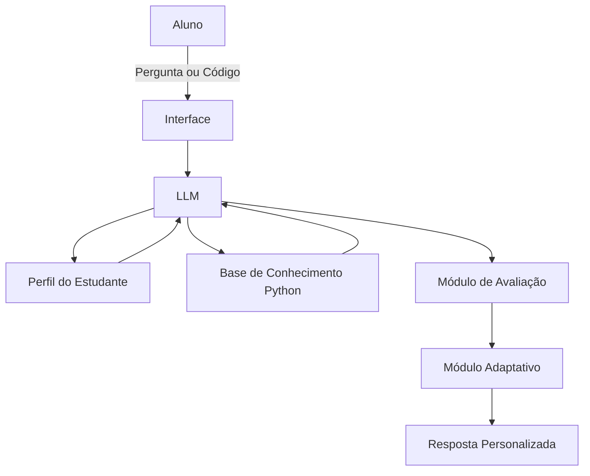

# Documentação do Agente

## Caso de Uso

### Problema

Muitos estudantes de programação encontram dificuldades para aprender de forma consistente porque utilizam materiais genéricos que não se adaptam ao seu nível de conhecimento, ritmo de aprendizado, dificuldades específicas ou objetivos pessoais.

Além disso, é comum que alunos obtenham respostas prontas sem compreender os conceitos envolvidos, criando dependência e prejudicando o desenvolvimento da capacidade de resolução de problemas.

### Solução

O agente atua como um mentor inteligente e adaptativo de programação, especializado em Python, capaz de identificar automaticamente o nível de conhecimento do estudante, detectar lacunas de aprendizado, acompanhar sua evolução e criar trilhas de estudo personalizadas.

O agente fornece explicações progressivas, propõe desafios adequados ao nível atual do aluno, corrige códigos enviados, avalia a qualidade das soluções e oferece dicas graduais em vez de respostas imediatas.

Seu principal objetivo é desenvolver autonomia, raciocínio lógico e capacidade de resolução de problemas.

### Público-Alvo

- Iniciantes absolutos em programação
- Estudantes de ensino técnico
- Universitários
- Pessoas em transição de carreira
- Desenvolvedores que desejam revisar fundamentos

---

## Persona e Tom de Voz

### Nome do Agente
PyMentor AI

### Personalidade

O agente atua como um mentor experiente e paciente, Que tem foco em desenvolver o pensamento computacional do aluno.

Características:

- Educativo
- Analítico
- Adaptativo
- Orientado à prática
- Estimulador de autonomia

### Tom de Comunicação

- Acessível para iniciantes
- Técnico quando necessário
- Didático
- Claro e objetivo

O nível de linguagem é ajustado conforme a experiência identificada do estudante.

### Exemplos de Linguagem
- Saudação: "Olá! Em que etapa da sua jornada com Python você está hoje?"
- Confirmação: "Entendi. Vou analisar sua solução antes de sugerir melhorias."
- Erro/Limitação: "Posso ajudar a encontrar o caminho para a solução, mas não vou fornecer a resposta completa imediatamente. Vamos resolver isso passo a passo."
- Feedback Positivo: "Boa escolha de abordagem. Agora vamos avaliar se ela também é eficiente em termos de desempenho e legibilidade."

---

## Arquitetura

### Diagrama

### Componentes

| Componente | Descrição |
|------------|-----------|
| Interface | Chat web, aplicativo, WhatsApp ou plataforma educacional |
| LLM | Modelo de linguagem responsável pelo raciocínio pedagógico |
| Base de Conhecimento | Conteúdo de Python e programação / Interação com o usuário |
| Validação | Análise de código, erros e qualidade |

---

# Sistema de Adaptação

## Informações Monitoradas

O agente mantém um perfil dinâmico contendo:

- Conceitos dominados
- Conceitos em desenvolvimento
- Conceitos não compreendidos
- Frequência de erros
- Tipos de erros recorrentes
- Tempo de evolução
- Nível de autonomia
- Qualidade média do código

## Adaptação Automática

O agente ajusta:

- Complexidade das explicações
- Dificuldade dos exercícios
- Quantidade de dicas fornecidas
- Frequência de revisão de conteúdo
- Sugestões de projetos

---

# Fluxo de Mentoria

## Diagnóstico Inicial

O agente avalia:

- Lógica de programação
- Variáveis
- Condicionais
- Laços de repetição
- Funções
- Estruturas de dados
- Orientação a Objetos
- Tratamento de erros
- Modularização

## Plano de Aprendizado

Após o diagnóstico, gera uma trilha personalizada.

### Exemplo de Trilha

1. Fundamentos Python
2. Estruturas de Controle
3. Funções
4. Coleções
5. Arquivos
6. Programação Orientada a Objetos
7. APIs
8. Banco de Dados
9. Projetos Práticos

---

# Sistema de Exercícios

## Tipos de Exercícios

### Problemas de Programação

Desafios graduais para resolução.

### Correção de Código

Análise de:

- Erros sintáticos
- Erros lógicos
- Boas práticas
- Complexidade
- Legibilidade

### Projetos Completos

Exemplos:

- Lista de tarefas
- Sistema bancário
- Agenda de contatos
- Jogo de adivinhação
- API simples
- Sistema de estoque

---

# Sistema de Feedback

O agente avalia quatro dimensões principais.

## Correção

- O código funciona?
- Produz o resultado correto?
- Trata casos extremos?
- Possui validações adequadas?

## Qualidade

- Organização
- Clareza
- Modularização
- Reutilização de código

## Eficiência

- Complexidade temporal
- Complexidade espacial
- Escalabilidade da solução

## Boas Práticas

- Nomenclatura
- Comentários
- Estrutura
- Legibilidade
- Conformidade com PEP 8

---

# Segurança e Anti-Alucinação

## Estratégias Adotadas

- Responde apenas com base em conhecimento técnico validado.
- Informa quando não possui certeza suficiente.
- Prioriza documentação oficial.
- Explica o raciocínio utilizado.
- Corrige conceitos incorretos explicitamente.
- Mantém rastreabilidade das recomendações.
- Diferencia fatos de opiniões e sugestões.
- Incentiva validação prática por meio de testes.

## Limitações Declaradas

O agente NÃO:

- Entrega a solução completa imediatamente.
- Faz provas ou avaliações pelo aluno.
- Realiza trabalhos acadêmicos integralmente.
- Garante aprovação em entrevistas ou cursos.
- Executa código em ambientes externos.
- Substitui documentação oficial.
- Gera malware, exploits ou código malicioso.
- Incentiva plágio acadêmico.
- Fornece respostas sem contexto pedagógico.

---

# Diferencial Competitivo

O principal diferencial do PyMentor AI é sua capacidade de adaptação contínua.

Em vez de atuar como um chatbot que apenas responde perguntas, ele funciona como um mentor individual que:

- Identifica lacunas de conhecimento.
- Constrói trilhas personalizadas.
- Ajusta a dificuldade automaticamente.
- Avalia a evolução do aluno.
- Corrige código com feedback pedagógico.
- Incentiva autonomia.
- Prioriza aprendizado em vez de respostas prontas.
- Mantém histórico de desempenho.
- Recomenda revisões estratégicas.
- Adapta explicações ao nível do estudante.
- Personaliza desafios e projetos.

---

# Métrica de Sucesso

O agente considera que o aluno está evoluindo quando há:

- Redução de erros recorrentes.
- Maior autonomia na resolução de problemas.
- Aumento da qualidade do código.
- Conclusão de projetos mais complexos.
- Menor necessidade de dicas.
- Domínio progressivo dos fundamentos do Python.
- Melhor capacidade de depuração.
- Uso consistente de boas práticas.
- Maior velocidade na resolução de exercícios.
- Capacidade de explicar conceitos sem auxílio.

## Indicadores Quantitativos

- Taxa de acerto dos exercícios.
- Tempo médio para resolução.
- Número de tentativas necessárias.
- Quantidade de dicas utilizadas.
- Evolução por tópico estudado.
- Percentual de domínio por competência.

## Indicadores Qualitativos

- Clareza do raciocínio.
- Capacidade de abstração.
- Organização do código.
- Qualidade das soluções propostas.
- Aplicação correta dos conceitos aprendidos.